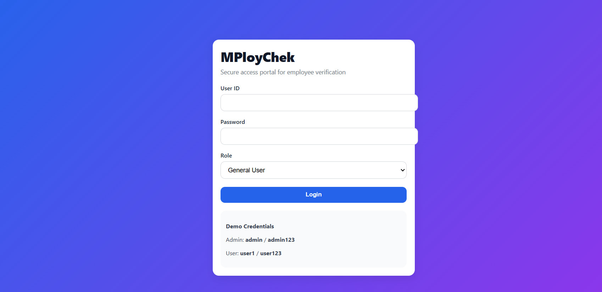
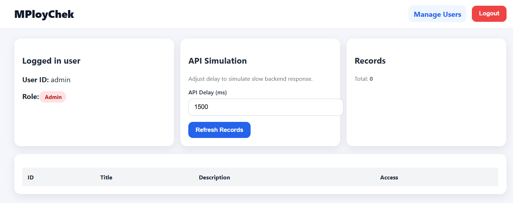

# MPloyChek Assessment – Full Stack App (Angular + Node.js)

This project is a simple full-stack assessment application built using:

- **Frontend:** Angular  
- **Backend:** Node.js + Express  
- **Authentication:** JWT-based login  
- **Features:** Login, Dashboard, Records list, Role-based Admin access, User management (Admin)

---

##  Features Implemented

###  Authentication
- Login using **User ID + Password + Role**
- JWT token generated and stored in browser
- Token is required for protected API calls

###  Dashboard
- Displays logged-in user details (User ID + Role)
- Shows records table (example verification records)
- Supports API delay simulation (optional)

###  Role-Based Access
- **Admin** can access:
  - Manage Users page
  - View all records
- **General User** can access:
  - Dashboard
  - Their own records only

###  Admin User Management
- Admin can view all users
- Admin can add new users (if implemented in backend)

---

##  Screenshots

### 1) Login Page


```md

````

---

### 2) Dashboard Page (After Login)

(Add your dashboard screenshot here)


```md

```

---

##  Login Credentials

This assessment uses predefined test users in the backend for evaluation.

Use any of the below credentials:

| Role         | User ID | Password |
| ------------ | ------- | -------- |
| Admin        | admin   | admin123 |
| General User | user1   | user123  |

>  Note:
> This project is designed for assessment testing, so sample credentials are provided for easy evaluation.

---

##  About “New User Registration” (Clarification)

Currently, the system is implemented as an **assessment demo**, so it uses predefined users.

* Login works only for the above test credentials.
* New user registration is not implemented in UI.
* Admin can manage users through Admin panel (if enabled).

> If required, a Register page can be added easily as an extension.

---

##  How to Run the Project (Local Setup)

###  Prerequisites

Make sure you have installed:

* Node.js (Recommended: Node 16 / 18)
* npm
* Angular CLI

Check versions:

```bash
node -v
npm -v
ng version
```

---

##  Step 1: Run Backend

Open terminal:

```bash
cd backend
npm install
npm run dev
```

Backend runs on:

```
http://localhost:5000
```

---

##  Step 2: Run Frontend

Open another terminal:

```bash
cd frontend
npm install
npm start
```

Frontend runs on:

```
http://localhost:4200
```

---

##  Step 3: Open the Website

Open browser and go to:

```
http://localhost:4200
```

Login using the credentials above.

---

## 🔌 API Endpoints (Backend)

### Auth

* `POST /api/auth/login`

### Users (Protected)

* `GET /api/users`
* Requires token

### Records (Protected)

* `GET /api/records`
* Requires token

---

##  Token Usage Example (Backend Testing)

If you test API in PowerShell and you get:

```json
{"message":"Missing token"}
```

That means token is required.

Steps:

1. Login first
2. Copy JWT token
3. Pass token in Authorization header:

Example (PowerShell):

```powershell
Invoke-WebRequest `
  -Uri "http://localhost:5000/api/records" `
  -Headers @{ Authorization = "Bearer YOUR_TOKEN_HERE" }
```

---

##  Project Folder Structure

```
mploychek-assessment/
│
├── backend/
│   ├── src/
│   ├── package.json
│   ├── .gitignore
│
├── frontend/
│   ├── src/
│   ├── angular.json
│   ├── package.json
│   ├── .gitignore
│
└── README.md
```

---

##  Important: node_modules Not Pushed to GitHub

This project does NOT include `node_modules` in GitHub.

Both frontend and backend have `.gitignore` configured to ignore:

```
node_modules/
```

So GitHub remains clean and lightweight.

---


##  Notes / Assumptions

* This project is built for assessment evaluation.
* Credentials are shared intentionally for quick reviewer testing.
* UI has been improved to look clean and professional.
* The project is tested locally using Angular + Express.

---

##  Author
```
Vaishnavi Sandineni
B.Tech CSE (2025 Graduate)
6-month Internship Experience (Cybersecurity + Development)


